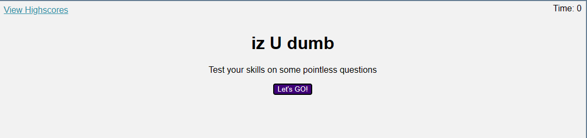
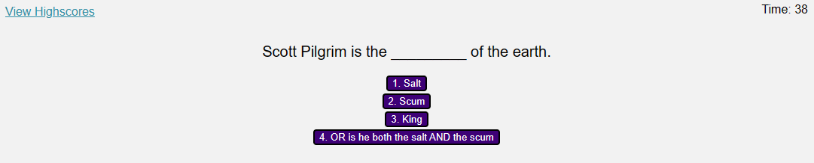
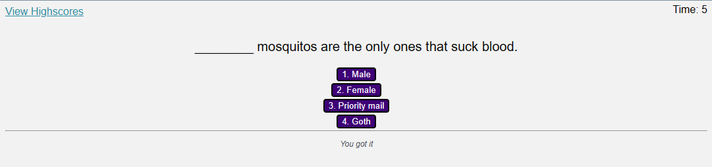
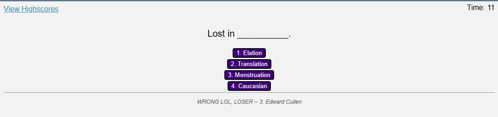
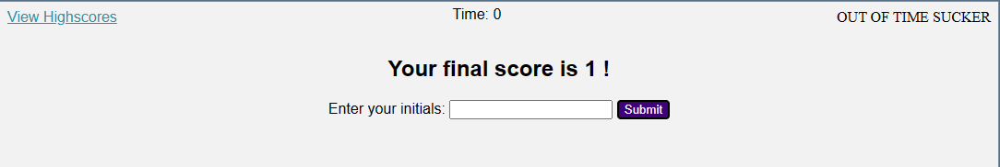
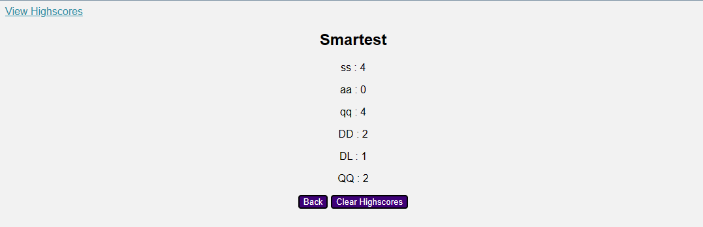
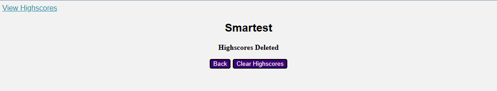

# guess-to-impress

## Description

 This is a multiple choice quiz made with JS, HTML, and CSS to test your knowledge on random unimportant information.

-This project was a way to create a multiple choice quiz mainly in JS with minimal html and CSS elements.
-The quiz was created as a way to hold a timer, multiple inputs and buttons, and a highscore page with some locally stored data.
-I learned quite a bit about using localstorage with this project. The code itself could use some cleaning up and simplifying, but learning to have all three code files to work together correctly (mostly) was a good start.
    --If I were to start this project again, I would focus on cleanliness and readability.

## Installation

N/A

## Usage
Page link:
https://d-lil.github.io/guess-to-impress/

At initial home screen you will see this page.
Clicking "View Highscores" will open a list of stored user initials and highscores (if any).
Clicking "Let's GO!" will start the (timed) quiz.

The quiz has begun. The timer in the top right has begun counting down from 40seconds.
Click the button you think is the answer to the question.

A right answer displays "You got it." Underneath the next question.

Selecting a wrong answer will display, "WRONG LOL, LOSER," along with the correct answer for the question you selected wrong.

If you run out of time, the top right corner of the screen displays "OUT OF TIME SUCKER" and the quiz ends displaying your final score.
You will see a place to enter your initials to be added to the highscores.

After submitting your initials, you will be brought to the page displaying previously recorded highscores (if any).
There will be a button to go back (restart quiz) and a button to clear highscores.

If you clear highscores, the message "Highscores Deleted" will display.

## Credits

Previous lesson activities.
Different assistance from classmates - mostly Ben Sboto and Dave - helped me review my code.
George Yoo (TA) spent a while helping me work out some issues I created for myself and helped guide me the right direction for finishing my project up. 
Thank you all!

## License

The MIT License (MIT)

Copyright (c) 2023 Daniel Liljegren

Permission is hereby granted, free of charge, to any person obtaining a copy of this software and associated documentation files (the "Software"), to deal in the Software without restriction, including without limitation the rights to use, copy, modify, merge, publish, distribute, sublicense, and/or sell copies of the Software, and to permit persons to whom the Software is furnished to do so, subject to the following conditions:

The above copyright notice and this permission notice shall be included in all copies or substantial portions of the Software.

THE SOFTWARE IS PROVIDED "AS IS", WITHOUT WARRANTY OF ANY KIND, EXPRESS OR IMPLIED, INCLUDING BUT NOT LIMITED TO THE WARRANTIES OF MERCHANTABILITY, FITNESS FOR A PARTICULAR PURPOSE AND NONINFRINGEMENT. IN NO EVENT SHALL THE AUTHORS OR COPYRIGHT HOLDERS BE LIABLE FOR ANY CLAIM, DAMAGES OR OTHER LIABILITY, WHETHER IN AN ACTION OF CONTRACT, TORT OR OTHERWISE, ARISING FROM, OUT OF OR IN CONNECTION WITH THE SOFTWARE OR THE USE OR OTHER DEALINGS IN THE SOFTWARE.